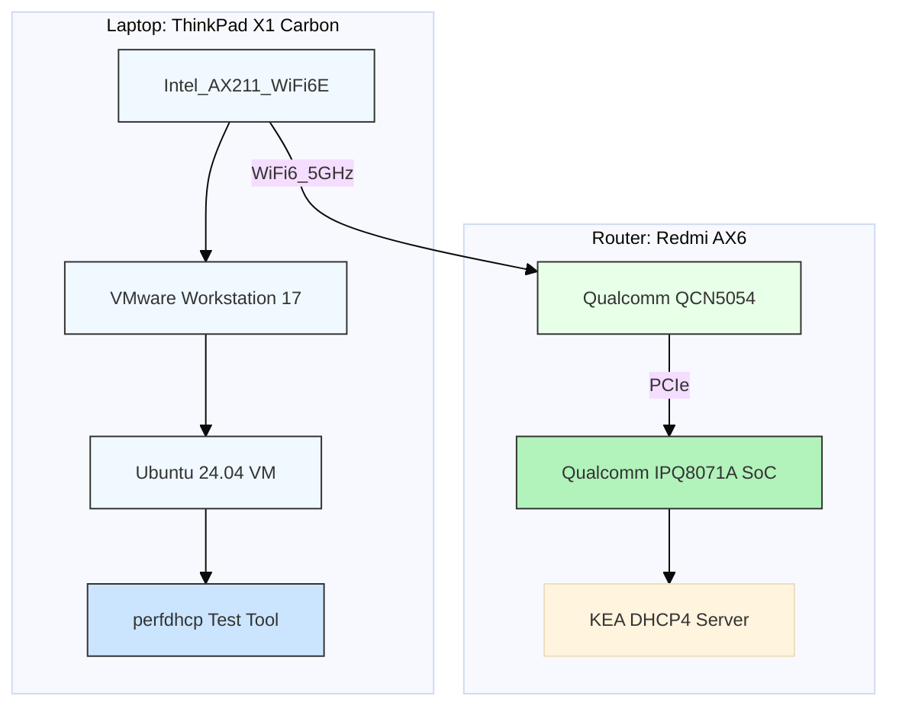

**KEA DHCP4 Performance Test Report on IPQ807X Platform**

**Test Environment**

**Device Under Test (DUT)**
- Model: Redmi AX6 Router
- SoC: Qualcomm IPQ8071A (4x Cortex-A53 @ 1.4GHz)
- Memory: 512MB DDR3
- Network: 5GHz WiFi (80MHz bandwidth, channel 36)
- DHCP Server: KEA DHCP4 with full Class B address pool
- Lease Time: 2 minutes

**Test Client Configuration**
- Hardware: ThinkPad X1 Carbon with Intel AX211 WiFi
- Virtualization: VMware Workstation 17
- Guest OS: Ubuntu 24.04 (bridged networking)
- Test Tool: perfdhcp (ISC DHCP performance measurement tool)

**Test Architecture Diagram**


**Test Methodology**
1. Baseline Test: 400 requests/sec with 2 threads
2. Stress Test: 600 requests/sec with 2 threads
3. Metrics Collected: Packet drops, latency statistics, successful exchanges

**Test 1 Results (400 requests/sec)**
```bash
perfdhcp -xi -t 2 -r 400 -R 10000 192.168.1.1
```
*This command simulates 10,000 DHCP clients, generating 400 4-way exchanges per second.*
- DISCOVER-OFFER Exchange:
  - Sent: 94,857 packets
  - Received: 94,856 packets
  - Drop Ratio: 0.00105%
  - Latency:
    - Min: 2.619ms
    - Avg: 4.537ms
    - Max: 32.591ms
    - Std Dev: 1.903ms

- REQUEST-ACK Exchange:
  - Sent: 94,856 packets
  - Received: 94,854 packets
  - Drop Ratio: 0.00211%
  - Latency:
    - Min: 2.740ms
    - Avg: 4.832ms
    - Max: 33.391ms
    - Std Dev: 1.731ms

**Test 2 Results (600 requests/sec - Stress Test to Find Maximum Throughput)**
```bash
perfdhcp -xi -t 2 -r 600 -R 10000 192.168.1.1
```
*This command simulates 10,000 DHCP clients, generating 600 4-way exchanges per second.*
- Achieved Rate: 482.211 4-way exchanges/sec
- DISCOVER-OFFER Exchange:
  - Sent: 12,323 packets
  - Received: 11,027 packets
  - Drop Ratio: 10.5169%
  - Latency:
    - Min: 3.727ms
    - Avg: 58.477ms
    - Max: 84.129ms
    - Std Dev: 10.268ms

- REQUEST-ACK Exchange:
  - Sent: 11,027 packets
  - Received: 9,905 packets
  - Drop Ratio: 10.2%
  - Latency:
    - Min: 3.603ms
    - Avg: 58.303ms
    - Max: 82.567ms
    - Std Dev: 10.527ms

## Detailed Performance Analysis (Target Rate: 400 exchanges/sec)
| Item                      | Value                | Evaluation                   |
|---------------------------|----------------------|------------------------------|
| Actual Rate               | 399.98 exchanges/sec | ✅ Perfectly achieved         |
| DISCOVER-OFFER Drop Rate  | 1 / 94857 ≈ 0.001%   | ✅ Nearly zero packet loss    |
| REQUEST-ACK Drop Rate     | 2 / 94856 ≈ 0.0021%  | ✅ Extremely low packet loss  |
| DISCOVER-OFFER Avg Delay  | 4.537 ms             | ✅ Very low latency           |
| REQUEST-ACK Avg Delay     | 4.832 ms             | ✅ Very low latency           |
| Max Delay (Overall)       | \~33 ms               | ✅ Fully acceptable           |
| Malformed / Rejected / Orphans | All zero        | ✅ Protocol handled perfectly |
| Short Waits               | 1,912,000            | 🔵 Normal behavior indicating high processing density |

### Overall Evaluation
- Extremely stable: At 400 4-way exchanges/sec, packet loss is nearly zero, showing Kea runs stably on AX6.
- Low and balanced latency: No backlog, queueing or spikes, indicating well-coordinated system scheduling, socket buffers, and CPU.
- Good hardware-software match: Indicates OpenWrt config, Kea compile options, and kernel UDP buffers are well optimized.
- High short waits: Means packets arrive frequently and the system keeps up, which is normal behavior.

*Although the 600 requests/sec stress test exceeded the system's performance ceiling and resulted in a ~10% packet drop, this is still an impressive result.
For a consumer-grade router, such as the Redmi AX6, achieving over 480 exchanges per second and supporting tens of thousands of DHCP clients is remarkably strong performance.*

**Note:** This is a preliminary and not fully rigorous performance test. The Qualcomm IPQ807X processor has 4 cores, but this test used only 2 threads, so CPU usage reached roughly 50% at peak load. Additionally, the WiFi connection introduces extra latency. Using a wired Ethernet connection and increasing to 4 threads could yield better performance and higher throughput.
